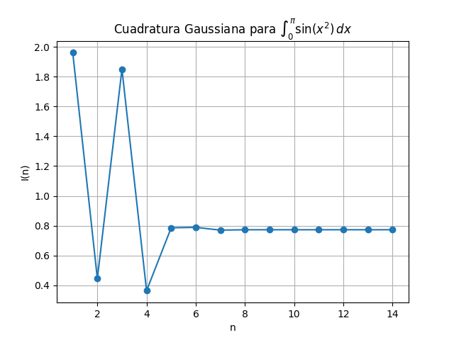

# Turorial de uso 

El archivo "cuadrature.py" se ejecuta de forma directa:

```bash
python -m cuadrature.cuadrature

```
Cuando se ejecuta el programa retorna los valores

```
En la iteración n =  1 el valor de la Integral es I = 1.9611893307
En la iteración n =  2 el valor de la Integral es I = 0.4444055099
En la iteración n =  3 el valor de la Integral es I = 1.8503636167
En la iteración n =  4 el valor de la Integral es I = 0.3635354764
En la iteración n =  5 el valor de la Integral es I = 0.7858090343
En la iteración n =  6 el valor de la Integral es I = 0.7886218902
En la iteración n =  7 el valor de la Integral es I = 0.7702887018
En la iteración n =  8 el valor de la Integral es I = 0.7725895134
En la iteración n =  9 el valor de la Integral es I = 0.7726873847
En la iteración n = 10 el valor de la Integral es I = 0.7726500263
En la iteración n = 11 el valor de la Integral es I = 0.7726515340
En la iteración n = 12 el valor de la Integral es I = 0.7726517312
En la iteración n = 13 el valor de la Integral es I = 0.7726517128
En la iteración n = 14 el valor de la Integral es I = 0.7726517126
```

Y finalmente muestra la gráfica generada automaticamente

